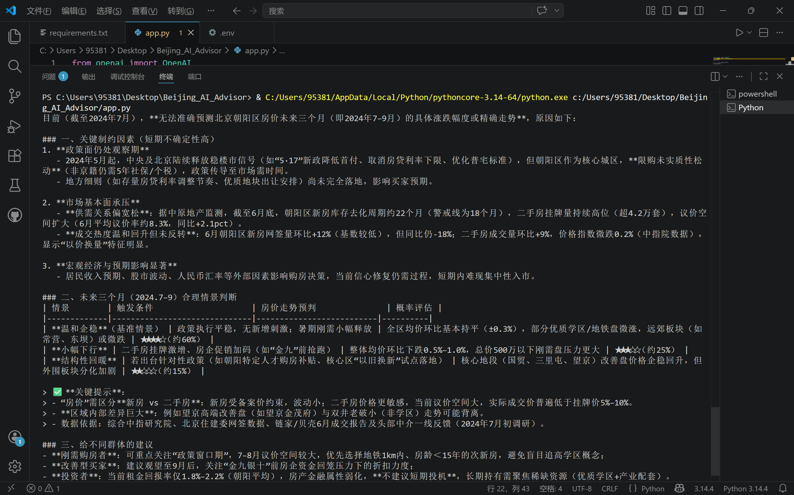
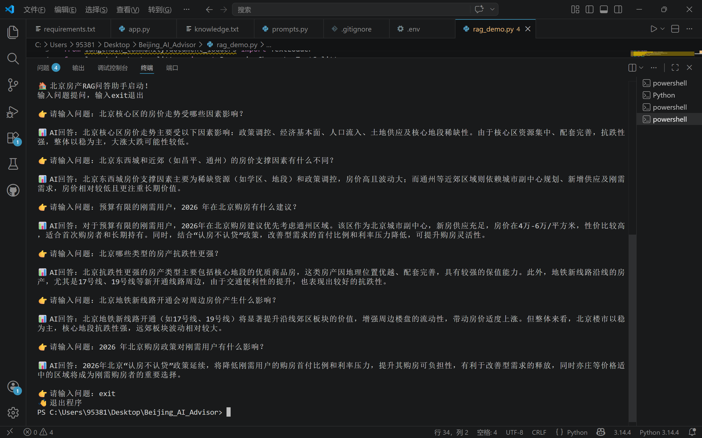
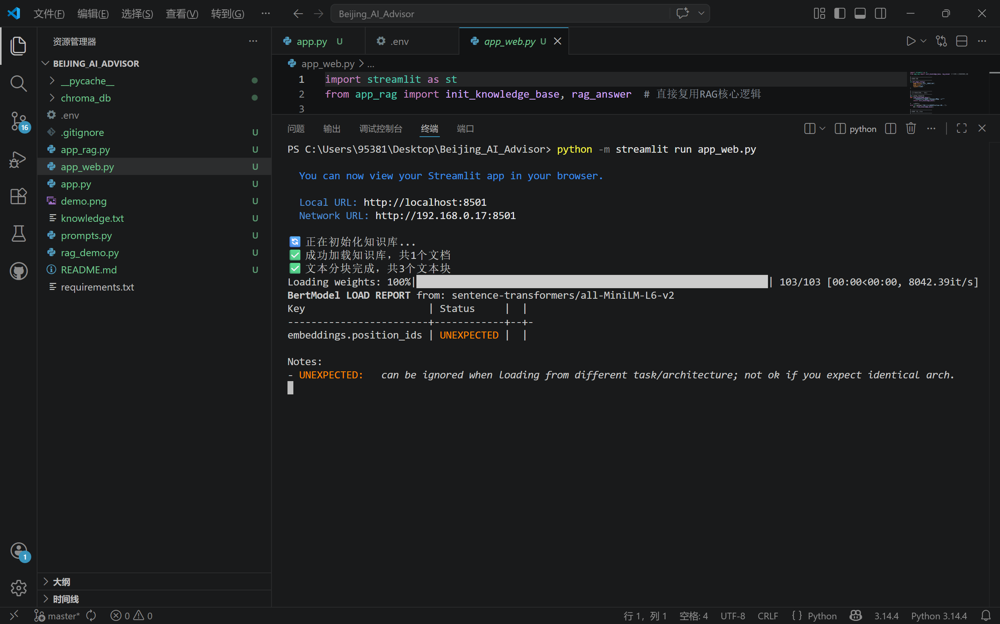
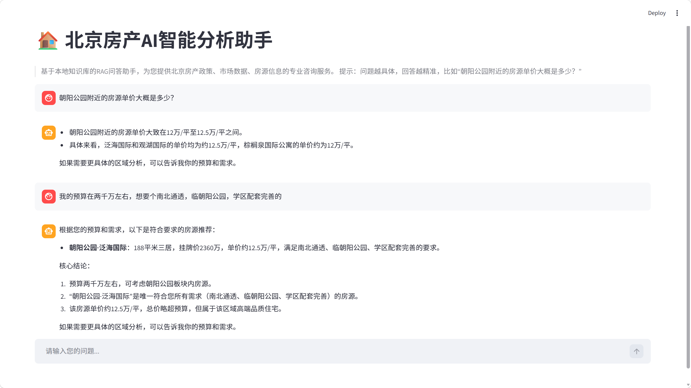

# 🏠 北京房产AI智能分析助手
> 基于阿里云通义千问大模型 + RAG知识库的房产咨询工具，个人Python实战项目
 --- 
 
 ## ✨ 项目亮点 
- 基于阿里云百炼通义千问API，稳定的大模型对话能力
- 本地知识库增强（RAG），支持北京房价、板块、政策等专业分析
- 多模式Prompt切换（默认/JSON/思维链），适配不同交互场景
- 轻量化设计，一键运行，无需复杂环境配置 
- 模块化架构，API调用与提示词模板分离，易扩展维护
- 内置`.env`密钥管理，保障API Key安全
- 支持Function Calling，AI可调用外部工具，实现天气查询等扩展能力
- 支持多轮对话，具备上下文记忆能力，对话体验更自然
 --- 
## 🚀 核心功能
 1. **多维度房产咨询** 
 - 北京房价走势、热门板块对比、政策解读等专业问答 
 - 支持JSON结构化输出，便于后续数据处理与分析 
 2. **RAG本地知识库增强** 
 - 基于ChromaDB向量数据库，实现语义检索
 - 结合本地房产知识库，提供更精准、专业的回答 
 3. **多模式交互支持**
 - 命令行模式：直接对话，快速获取分析结果 
 - Web可视化界面：Streamlit搭建，支持对话历史与多模式切换
 4. **Function Calling 工具调用**
 - 支持AI调用外部工具，如天气查询等实用功能
 - 可扩展更多工具，实现房贷计算、政策查询等场景
 5. **多轮对话上下文记忆**
 - 完整保留对话历史，支持指代、上下文关联提问
 - 实现连贯对话体验，如“你刚才提到的小区哪个最贵？”  
 6. **安全与可维护性**
 - `.env`文件管理敏感信息，避免密钥泄露
 - 模块化代码结构，API、Prompt、RAG模块分离，便于扩展
 --- 
 ## 🛠️ 技术栈
 | 模块 | 技术/工具 | 用途 |
 | - | - | - |
 | 开发语言 | Python 3.x | 项目核心开发语言 | 
 | 大模型服务 | 阿里云百炼通义千问API | 核心对话与分析能力 |
 | 向量数据库 | ChromaDB | 本地知识库存储与语义检索 |
 | Web界面 | Streamlit | 可视化交互界面搭建 | 
 | 依赖管理 | requirements.txt | 项目依赖统一管理 |
 | 环境配置 | python-dotenv | `.env`文件加载与密钥管理 | 
 | 工具调用 | OpenAI Function Calling | 支持AI调用外部工具 |
  --- 
  ## 📁 项目结构
```

Beijing_AI_Advisor/
├── 📄 核心代码文件
│   ├── app.py                   # 主入口：通义千问客户端 + 多模式对话
│   ├── app_rag.py               # RAG 核心模块：知识库 + 向量检索
│   ├── app_fc.py                # RAG + Function Calling 整合
│   ├── app_web.py               # Streamlit Web 界面
│   ├── app_ui_multi_turn.py     # 多轮对话界面（带记忆）
│   ├── function_calling_demo.py # Function Calling 演示
│   ├── prompts.py               # 多模式 Prompt 模板
│   ├── rag_demo.py              # RAG 检索效果测试
│   ├── api_server.py            # FastAPI 后端服务（新增）
│   ├── database_manager.py      # SQLite 对话存储（新增）
│
├── 📚 项目资源文件
│   ├── knowledge.txt            # 北京房产知识库
│   ├── demo.png                 # 项目演示截图
│   ├── demo_rag.png             # RAG 效果截图
│   ├── demo_terminal.png        # 启动日志截图
│   ├── demo_web.png             # Web 界面截图
│
├── ⚙️ 配置与依赖文件
│   ├── .env                     # API Key 配置（不上传 Git）
│   ├── .gitignore               # 忽略缓存、密钥等文件
│   ├── requirements.txt         # 项目依赖清单
│   └── README.md                # 项目说明（本文件）
│
└── 📂 自动生成文件
    ├── chroma_db/               # Chroma 向量库
    ├── chat_history.db           # SQLite 对话历史库
    └── __pycache__/
```
---

## 🚩 快速开始
### 1 . 环境准备

#### 克隆仓库 
``git clone https://github.com/你的用户名/Beijing_AI_Advisor.git``

``cd Beijing_AI_Advisor ``

#### 安装依赖 

```pip install -r requirements.txt```

### 2 . 配置API Key
在项目根目录创建 `.env` 文件，写入你的阿里云 API 密钥：

``API_KEY=你的阿里云百炼API密钥 ``

``BASE_URL=https://dashscope.aliyuncs.com/compatible-mode/v1``

### 3. 运行项目
#### 版本1：基础对话版
```python app.py```
#### 版本2:RAG知识库问答(终端版)	
##### 本项目支持基于本地文档的RAG增强问答，让AI结合你提供的北京房产知识精准回答。
1. 在knowledge.txt中添加你想让Al参考的知识点(如房价数据，政策解读，真实房源信息等)
2. 运行 RAG主程序：
Windows PowerShell先设置国内镜像(避免模型下载失败)

```Senv:HF_ENDPOINT	"https://hf-mirror.com"	```
##### 运行终端版RAG助手

```python app_rag.py```

#### 版本3:Streamlit 网页版(推荐)
一键启动带界面的AI助手，体验更接近 ChatGPT:

``python -m streamlit run app_web.py``

---

## 📸 基础问答版本

## 📸 RAG问答版本
知识库加载。向量检索与问答结果展示

## 📸 Streamlit服务启动日志
服务启动过程与端口信息展示

## 📸 Streamlit网页交互界面
AI 助手可视化对话界面


---
### 📧 关于作者
**邮箱**:[hhq518@163.com](mailto:hhq518@qq.com)
