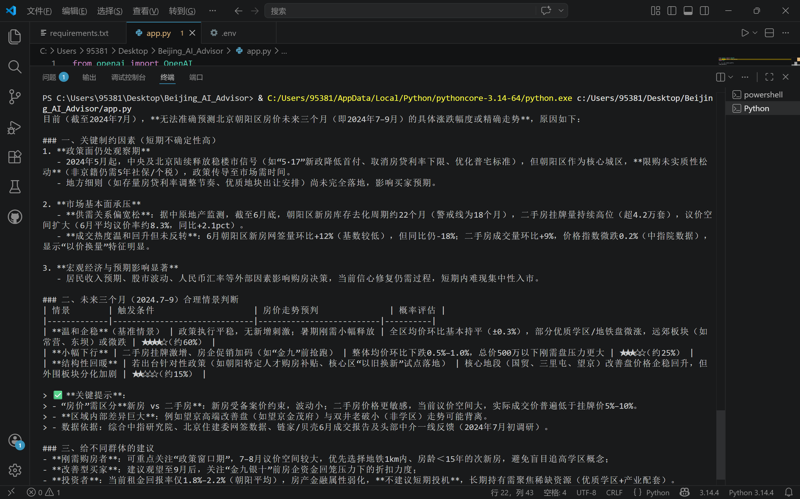

# 🏠 Beijing AI Advisor

A beginner-friendly AI portfolio project for Beijing real-estate consultation. The repository contains both a working production-style application and several standalone educational demos that show how the project evolved.

## What this project demonstrates

- DashScope / Qwen chat completion through the OpenAI-compatible API.
- RAG over a local `knowledge.txt` file with ChromaDB.
- Streamlit web UI examples for single-turn and multi-turn chat.
- FastAPI service wrapper around the LangChain Agent.
- Educational examples for Function Calling, tool orchestration, RAG, and input security.

## Repository structure

```text
Beijing_AI_Advisor/
├── api_server.py              # FastAPI production API entry point
├── app.py                     # Basic production CLI chat entry point
├── app_agent.py               # Agent implementation example with tools and memory
├── app_agent_LangChain.py     # LangChain Agent used by the API server
├── app_ui_web.py              # Streamlit RAG web UI
├── app_ui_multi_turn.py       # Streamlit multi-turn chat UI
├── database_manager.py        # SQLite session storage and ChromaDB helper classes
├── prompts.py                 # Prompt templates
├── knowledge.txt              # Local Beijing real-estate knowledge base
├── docs/architecture.md       # Architecture notes and diagram
├── images/                    # Project screenshots and presentation assets
├── Dockerfile                 # Streamlit container
├── Dockerfile.api             # FastAPI container
├── docker-compose.yml         # Local container orchestration
├── requirements.txt           # Python dependencies
├── .env.example               # Safe environment variable template
│
├── app_fc.py                  # Educational demo: RAG + Function Calling
├── app_rag.py                 # Educational demo and reusable RAG functions
├── tool_orchestration_demo.py # Educational demo: tool routing/orchestration
└── security_guard.py          # Educational demo: prompt-injection/input guard
```

Generated files such as `chroma_db/`, `chat_history.db`, `agent_sessions.db`, `agent_audit_log.json`, and `__pycache__/` are created at runtime and should not be edited manually.

## Production path

The clearest production-style path is:

1. `app_ui_multi_turn.py` or `app_ui_web.py` provides a Streamlit UI.
2. `api_server.py` exposes Agent functionality through FastAPI.
3. `app_agent_LangChain.py` contains the LangChain Agent used by the API.
4. `database_manager.py` stores chat history and supports vector storage helpers.
5. `knowledge.txt` and `app_rag.py` provide the local RAG knowledge source and retrieval functions.

The educational demo files are intentionally preserved for learning and interview discussion. They are useful for explaining the project evolution, but they are not the main production deployment path.

## Environment variables

Create a local `.env` file from the example template:

```bash
cp .env.example .env
```

Then fill in your DashScope credentials:

```env
DASHSCOPE_API_KEY=your_dashscope_api_key_here
DASHSCOPE_BASE_URL=https://dashscope.aliyuncs.com/compatible-mode/v1
```

Do not commit `.env` files. Only `.env.example` should be stored in Git.

## Local setup

```bash
python -m venv .venv
source .venv/bin/activate  # Windows PowerShell: .venv\Scripts\Activate.ps1
pip install -r requirements.txt
cp .env.example .env
```

Update `.env` with your real `DASHSCOPE_API_KEY` before running any AI features.

## Run commands

### Basic CLI chat

```bash
python app.py
```

### RAG CLI demo

```bash
python app_rag.py
```

### Streamlit RAG web UI

```bash
python -m streamlit run app_ui_web.py --server.address 0.0.0.0 --server.port 7860
```

### Streamlit multi-turn web UI

```bash
python -m streamlit run app_ui_multi_turn.py --server.address 0.0.0.0 --server.port 7860
```

### FastAPI service

```bash
python -m uvicorn api_server:app --host 0.0.0.0 --port 8000
```

Health check:

```bash
curl http://localhost:8000/health
```

## Docker usage

Build and run the Streamlit UI container:

```bash
docker build -t beijing-ai-advisor .
docker run --env-file .env -p 7860:7860 beijing-ai-advisor
```

Build and run the FastAPI container:

```bash
docker build -f Dockerfile.api -t beijing-ai-advisor-api .
docker run --env-file .env -p 8000:8000 beijing-ai-advisor-api
```

Run with Docker Compose:

```bash
docker compose up --build
```

The compose file starts both services:

- Streamlit UI: <http://localhost:7860>
- FastAPI API: <http://localhost:8000>

## Screenshots



## Interview talking points

- Explain the difference between the production path and educational demos.
- Show how RAG grounds answers in `knowledge.txt`.
- Discuss why `.env` protects secrets and why `.env.example` documents configuration safely.
- Walk through the layered architecture in `docs/architecture.md`.
- Demonstrate local and Docker startup commands.
