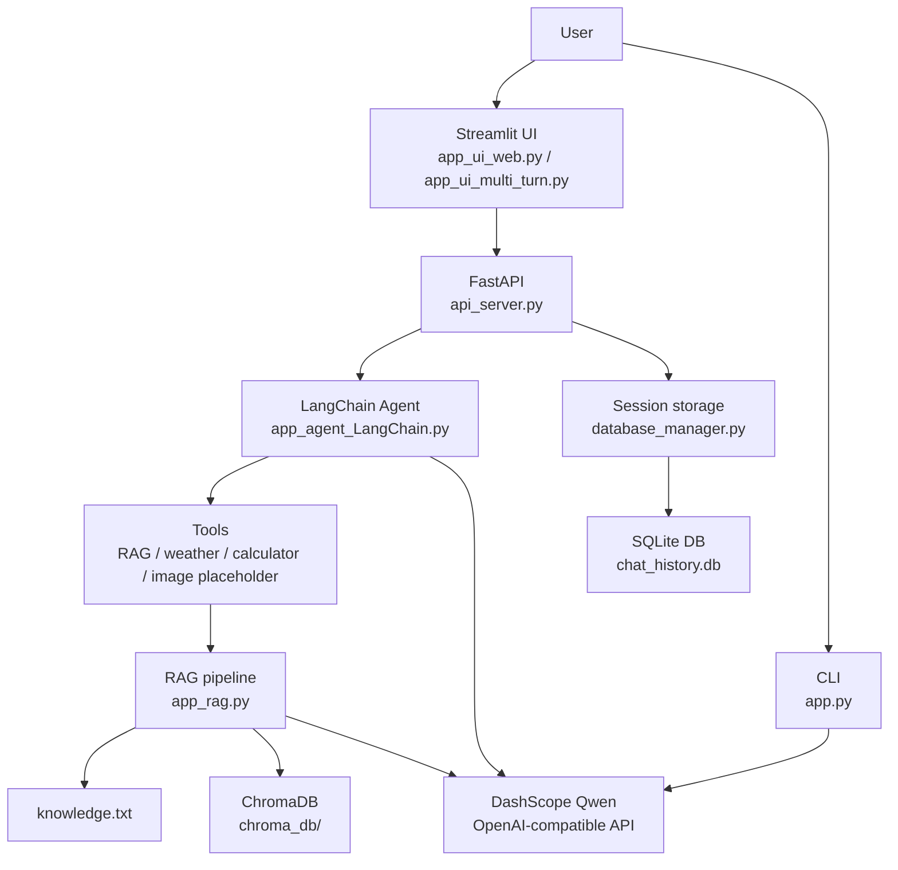

# Architecture

This project is intentionally small and interview-friendly. It keeps the production-style application separate from educational demos so the learning path remains easy to explain.

## Layered architecture

1. **Presentation layer**
   - `app_ui_web.py` provides a Streamlit RAG chat interface.
   - `app_ui_multi_turn.py` provides a Streamlit multi-turn chat interface.
   - `app.py` provides a simple CLI entry point.

2. **API layer**
   - `api_server.py` exposes HTTP endpoints for chat, health checks, image upload placeholders, and history lookup.

3. **Agent and orchestration layer**
   - `app_agent_LangChain.py` defines the LangChain Agent used by the API server.
   - `app_agent.py` is another production-file Agent example with tools and memory.

4. **RAG and prompt layer**
   - `app_rag.py` loads `knowledge.txt`, chunks content, creates embeddings, persists ChromaDB data, and generates grounded answers.
   - `prompts.py` stores reusable prompt templates.

5. **Memory and storage layer**
   - `database_manager.py` manages SQLite chat history and ChromaDB helper classes.
   - Runtime-generated storage includes `chat_history.db`, `agent_sessions.db`, `agent_audit_log.json`, and `chroma_db/`.

## Mermaid diagram



## Relationship between UI, API, Agent, RAG, Memory, and Storage

- The **UI** collects user input and displays responses.
- The **API** gives the project a deployable HTTP boundary for integration.
- The **Agent** decides how to answer and can call tools.
- The **RAG pipeline** retrieves relevant facts from `knowledge.txt` before asking the model to answer.
- **Memory** keeps recent conversation context for better multi-turn behavior.
- **Storage** persists chat history and vector data so the application can restart without losing generated runtime state.

## Production path

For a portfolio or interview demo, present this as the main flow:

```text
User → Streamlit UI or FastAPI → LangChain Agent → RAG/tools → DashScope Qwen → response
```

The API-centered path is:

```text
api_server.py → app_agent_LangChain.py → database_manager.py / tools → DashScope Qwen
```

The UI-centered RAG path is:

```text
app_ui_web.py → app_rag.py → knowledge.txt + chroma_db/ → DashScope Qwen
```

## Educational demos

These files are intentionally kept and should not be deleted:

- `app_fc.py` demonstrates Function Calling with RAG/tool routing.
- `app_rag.py` demonstrates local RAG retrieval and is also reused by the Streamlit RAG UI.
- `tool_orchestration_demo.py` demonstrates tool orchestration concepts.
- `security_guard.py` demonstrates input validation and prompt-injection guard ideas.

They help explain the project evolution without forcing all ideas into one large file.
